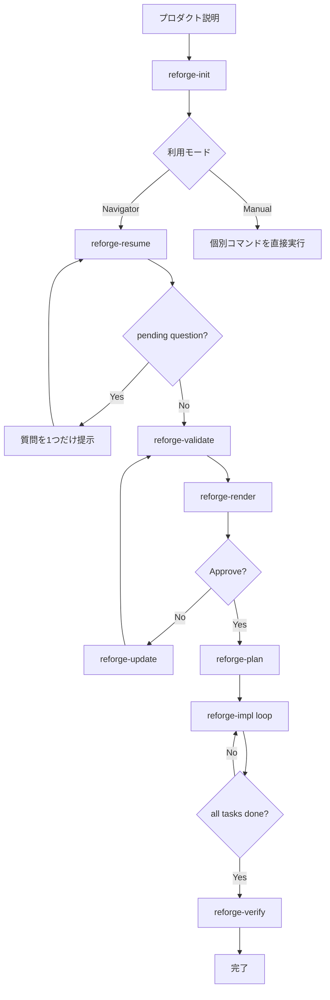
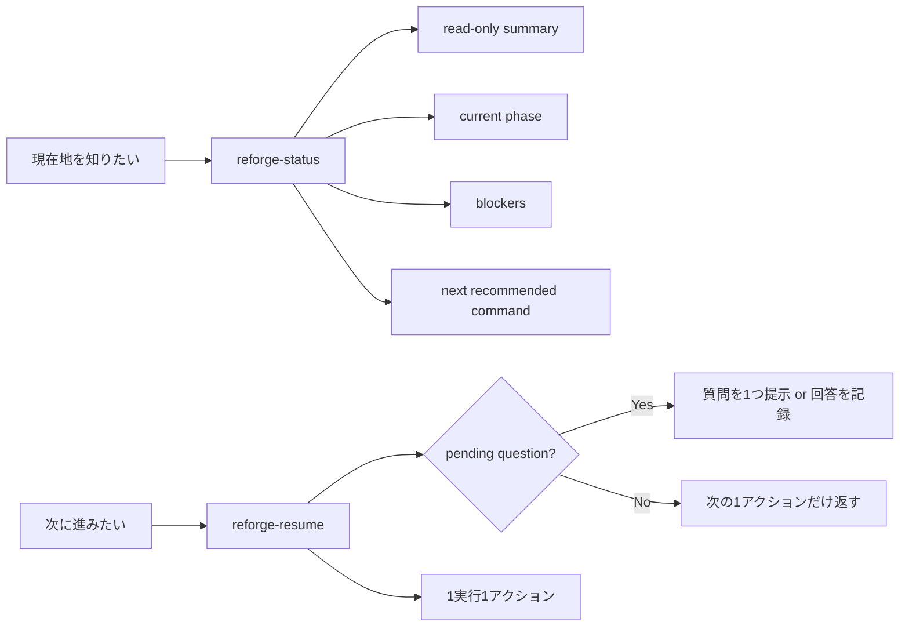
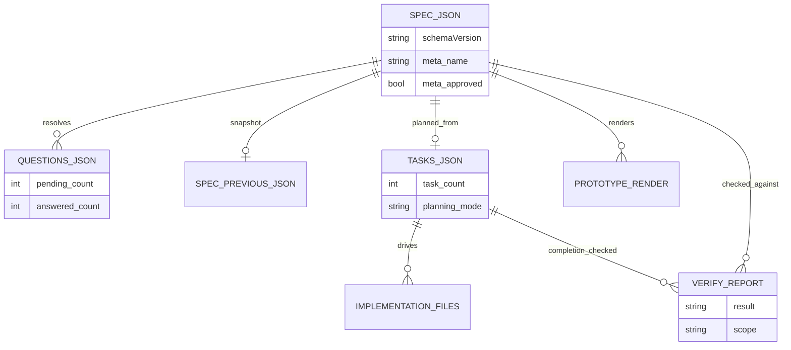

# Reforge 公開リリース仕様チェックリスト

## エグゼクティブサマリー

この仕様の目的は、**このチェックリストをすべて満たしたときに、Reforge を「公開してよい」「他人が試して評価できる」「継続的に採用されうる」状態へ持っていくこと**です。判断基準は、単にコマンドが動くことではありません。**公開 API が明確であること、導入と撤退が安全であること、Skills の挙動が予測可能であること、README と Docs が初見ユーザーを迷わせないこと、検証の保証範囲が誇張されていないこと**を必須条件とします。Semantic Versioning は公開 API の明示を前提にしており、GitHub の README/コミュニティ健全性ガイドは README・CONTRIBUTING・SUPPORT・SECURITY などの公開 OSS に必要な“期待値の表明”を重視しています。Diátaxis は tutorial / how-to / reference / explanation を分けるべきだと明示しています。さらに、両エージェント環境の Skills 公式ドキュメントは、**Skill は一つの仕事に集中させ、説明は明確にし、必要なら supporting files に逃がし、配布単位と呼び出し方を明示する**ことを推奨しています。citeturn6view5turn6view12turn6view7turn6view6turn9view0turn7view5turn8view3turn12view0turn10view0

このレポートでは、**MVP を 18 項目**、**近接ロードマップを 8 項目**、**長期ロードマップを 5 項目**に分けます。公開リリースの定義は明確にします。**MVP 全項目が pass、最小 CI ゲートが全て green、外部ユーザーによる導入テストが完了、README と docs-only で初回成功が再現できる**。これを満たすまで「公開はできても、広く採用される準備は未完」です。逆に、MVP を満たせば「出してよい」、MVP + 近接ロードマップの大半を満たせば「広く使われうる」に入ります。citeturn6view5turn6view12turn6view6turn6view11turn13view0turn6view10

主な一次ソースは、urlGitHub README guidanceturn6view12、urlGitHub community health guidanceturn6view7、urlDiátaxisturn6view6、urlSemantic Versioning 2.0.0turn6view5、urlClaude Code skills docsturn6view0、urlCodex skills docsturn6view1、urlCodex plugin docsturn6view3、urlOpenAI Skills API guideturn10view0です。

## 設計アンカーと前提条件

Reforge の前提は変えません。対象ユーザーは、**AI エージェントで web アプリを作る開発者**です。中心ユースケースは **Spec-as-SSoT + ローカル UI プロトタイプ + entity-centric implementation** です。前提環境は entity["software","Node.js","JavaScript runtime"] 18+、対応エージェントは entity["software","Claude Code","AI coding agent"] と entity["software","Codex","OpenAI coding agent"] です。ここは MVP で広げすぎないほうがよく、むしろ「どこまでを約束し、どこから先は未確定か」を先に固定すべきです。SemVer の観点では、Reforge の公開 API は npm パッケージ名だけではなく、**コマンド意味論、workspace ファイル契約、skill パス、承認ゲート、verify の保証範囲、docs-backed examples** まで含みます。これを明示して初めてバージョニングが意味を持ちます。citeturn6view5turn10view0turn9view0turn8view3

Docs の設計原則は、GitHub README ガイドと Diátaxis をそのまま採用してよいです。README は「何をするか / なぜ useful か / どう始めるか / どこで助けを得るか / 誰が保守するか」を最初に伝えるべきで、Docs は tutorial / how-to / reference / explanation に分割したほうが初見ユーザーの迷子を防げます。Reforge は現在 reference 寄りの強さがあるため、公開前の最大課題は tutorial と explanation の補強です。citeturn6view12turn6view6

### 優先度マトリクス

| 優先度 | 意味 | 公開リリース条件との関係 |
|---|---|---|
| MVP | 公開前に必須。これが欠けると public contract が曖昧になる | 必須 |
| 近接 | 初回公開後 1〜3 リリース以内に欲しい。採用率を押し上げる | 強く推奨 |
| 長期 | ceiling を上げる。プラットフォーム化や既存巨大 repo への適応力を高める | 任意 |

### テストフィクスチャ

| フィクスチャ | 目的 |
|---|---|
| FX-A | greenfield の最小 web-app repo |
| FX-B | 既存 web-app repo。ルート・UI・テスト・既存規約あり |
| FX-C | 複数 spec を持つ repo |
| FX-D | 壊れた workspace。invalid spec / bad refs / empty flows |
| FX-E | 承認済み spec + tasks + 一部実装済み |
| FX-F | entity["software","Claude Code","AI coding agent"] 専用環境 |
| FX-G | entity["software","Codex","OpenAI coding agent"] 専用環境 |
| FX-H | 両方の agent 環境がある repo |
| FX-I | Docs smoke test 専用 repo |
| FX-J | 旧 schema version を持つ upgrade fixture |

### 例示用リポジトリ名

| 用途 | 推奨名 |
|---|---|
| canonical happy path | `examples/daily-report-reference` |
| approval-heavy app | `examples/approval-workflow-reference` |
| existing repo adoption | `examples/existing-repo-adoption` |
| multi-spec sample | `examples/multi-spec-reference` |

### いま固定しないもの

不明なものを埋めにいくのではなく、**未確定として明示**します。

| 項目 | 取り扱い |
|---|---|
| `meta/tech/entities/views/flows` 以外の schema 詳細 | **unspecified**。拡張ポリシーだけ定義する |
| permissions / validation / integrations / jobs / state machines の正確な field 名 | **unspecified** |
| approval 証跡の保存先 | **unspecified**。ただし audit trail の存在は必須 |
| runtime verify の実行方法 | **unspecified**。ただし guarantee boundary は固定する |
| generated file paths の stack ごとの差異 | **unspecified**。ただし public API に含めるか否かは明示する |

## ワークフロー契約、ファイル契約、Skills 契約

Reforge の公開 UX は、**inspect と mutate を分離**したときに初めて分かりやすくなります。いま最優先で直すべき論点は `status` と `resume` の役割分離です。公式 Skills ドキュメントでは、side effect を持つ workflow は explicit-only にすべきで、skill は一つの仕事に集中し、説明・supporting files・tool permissions を明示すべきだとされています。entity["software","Claude Code","AI coding agent"] では `disable-model-invocation: true` が side-effecting workflow の手動起動に向いており、`allowed-tools` は workspace trust 後に効くため skill 自体が広い権限を持ちうることが明示されています。entity["software","Codex","OpenAI coding agent"] では `SKILL.md` に `name` と `description` が必須で、`agents/openai.yaml` で `allow_implicit_invocation: false` を設定できます。さらに reusable distribution は repo-local skill folders より plugin が推奨され、旧 custom prompts は deprecated です。citeturn9view0turn9view1turn7view5turn8view3turn6view1turn7view7turn7view8turn6view4turn12view0turn10view0

### navigator と manual のフロー



### `status` と `resume` の役割分離



### spec ファイルの ER 図



### CLI と Skill の責務分離

| コマンド | 推奨実装 | 理由 |
|---|---|---|
| `npx reforge install` | CLI-only | repo への配置と環境検出は agent 内より CLI が適切 |
| `npx reforge doctor` | CLI-only | 環境診断は read-only なシステム操作 |
| `npx reforge uninstall` | CLI-only | rollback/cleanup は CLI の責務 |
| `npx reforge migrate` | CLI-only | versioned workspace migration は CLI 向き |
| `reforge-init` | Skill-first | 自然言語→spec が agent の主役 |
| `reforge-status` | Skill-first | ワークフロー把握を agent 内で完結 |
| `reforge-resume` | Skill-first | 対話的に次へ進める中心コマンド |
| `reforge-update` | Skill-first | NL 変更指示の適用 |
| `reforge-diff` | Skill-first | spec 差分レビュー |
| `reforge-validate` | Skill-first | spec 検証 |
| `reforge-render` | Skill-first + ローカル server | prototype review gate |
| `reforge-plan` | Skill-first | agent による計画生成 |
| `reforge-impl` | Skill-first | entity-centric 実装 |
| `reforge-verify` | Skill-first | read-only conformance check |

### 最小 `spec.json` 契約

`meta/tech/entities/views/flows` 以外は **unspecified** のままにします。MVP の schema は次だけを必須にします。

```jsonc
{
  "schemaVersion": "1",
  "meta": {
    "name": "string",
    "lang": "string",
    "approved": false
  },
  "tech": {
    "frontend": "string",
    "backend": "string",
    "database": "string",
    "orm": "string",
    "styling": "string",
    "testing": "string"
  },
  "entities": {},
  "views": {},
  "flows": {}
  // extensions beyond this point: unspecified
}
```

### 推奨ファイルツリー

```text
packages/reforge/
  src/
    cli/
      install.ts
      doctor.ts
      uninstall.ts
      migrate.ts
    workspace/
    renderer/
    planning/
    verification/
  skills/
    claude/
      reforge-init/
        SKILL.md
        reference.md
        examples.md
      reforge-status/
        SKILL.md
        reference.md
        examples.md
      reforge-resume/
        SKILL.md
        reference.md
        examples.md
      reforge-update/
      reforge-diff/
      reforge-validate/
      reforge-render/
      reforge-plan/
      reforge-impl/
      reforge-verify/
    codex/
      reforge-init/
        SKILL.md
        reference.md
        examples.md
        agents/openai.yaml
      reforge-status/
        SKILL.md
        reference.md
        examples.md
        agents/openai.yaml
      reforge-resume/
        SKILL.md
        reference.md
        examples.md
        agents/openai.yaml
      reforge-update/
      reforge-diff/
      reforge-validate/
      reforge-render/
      reforge-plan/
      reforge-impl/
      reforge-verify/
docs/
  tutorials/
    hello-reforge.md
  guides/
    status-vs-resume.md
    adopt-existing-repo.md
    recovery-and-rollback.md
    reviewing-prototypes.md
  reference/
    cli-and-skills.md
    spec-schema.md
    questions-schema.md
    tasks-schema.md
    verify-contract.md
    support-matrix.md
    limitations.md
    troubleshooting.md
  explanation/
    why-reforge.md
examples/
fixtures/
.github/
CONTRIBUTING.md
CODE_OF_CONDUCT.md
SUPPORT.md
SECURITY.md
CHANGELOG.md
README.md
```

### `npx reforge install` の推奨挙動

`install` は環境差分を**隠さずに明示**すべきです。entity["software","Claude Code","AI coding agent"] は `/skill-name` 直呼び出しを公式にサポートし、project skills は `.claude/skills/` に置けます。entity["software","Codex","OpenAI coding agent"] は repo-local skills を `.agents/skills/` から読む一方、reusable distribution は plugin が推奨で、旧 custom prompts に依存した slash-command 互換 UX は避けるべきです。したがって install は「両者に同じ UI を装う」のではなく、「それぞれの正しい呼び出し面」を表示するべきです。citeturn6view0turn7view4turn8view3turn6view4turn12view0

**推奨 install 出力例（Claude のみ検出）**
```text
$ npx reforge install

Reforge skills installed to:
  .claude/skills/

Available project skills:
  /reforge-init
  /reforge-status
  /reforge-resume
  /reforge-update
  /reforge-diff
  /reforge-validate
  /reforge-render
  /reforge-plan
  /reforge-impl
  /reforge-verify

Next:
  1. Open your project in Claude Code
  2. Run /reforge-init "your product description"
  3. Run /reforge-status anytime to inspect state
```

**推奨 install 出力例（Codex のみ検出）**
```text
$ npx reforge install

Reforge skills installed to:
  .agents/skills/

Available repo-local skills:
  reforge-init
  reforge-status
  reforge-resume
  reforge-update
  reforge-diff
  reforge-validate
  reforge-render
  reforge-plan
  reforge-impl
  reforge-verify

How to invoke in Codex:
  - open the skill picker with /skills
  - or type $ and select the skill
  - explicit workflow skills should be invoked manually

Next:
  1. Open your project in Codex
  2. invoke the reforge-init skill with your product description
  3. use reforge-status to inspect state
```

**推奨 install 出力例（両方検出）**
```text
$ npx reforge install

Installed:
  .claude/skills/
  .agents/skills/

Claude Code:
  use /reforge-init, /reforge-status, /reforge-resume, ...

Codex:
  use /skills or $ to select reforge-init, reforge-status, reforge-resume, ...

Note:
  Reforge keeps the same workflow concepts across agents,
  but invocation UI differs by environment.
```

### `reforge doctor` の CLI 仕様

| 項目 | 仕様 |
|---|---|
| 目的 | install 前後の readiness 診断 |
| 形式 | `npx reforge doctor [--json] [--fix=none|safe]` |
| read set | repo root, `.claude/`, `.agents/`, `.reforge/`, `package.json`, lockfile, runtime version |
| write set | 既定ではなし。`--fix=safe` 時のみ安全な修復候補 |
| 最低限の診断対象 | Node version, repo root, skill install presence, duplicate installs, workspace schema version, renderer prerequisites, missing manifests, unsupported environments |
| 終了コード | `0=ready`, `1=warning`, `2=not-ready`, `3=fatal/internal` |
| 出力 | pass/warn/fail、理由、修復案、次に打つコマンド |

### `reforge uninstall` の CLI 仕様

| 項目 | 仕様 |
|---|---|
| 目的 | Reforge 管理下の skill files / install metadata を安全に削除 |
| 形式 | `npx reforge uninstall [--target=claude|codex|all] [--purge-workspace=false]` |
| read set | install manifest, skill directories, workspace root |
| write set | managed skill files, install manifest |
| 既定動作 | skill files のみ削除、workspace は残す |
| purge 動作 | 明示フラグがある場合のみ `.reforge/` も削除候補に含める |
| 必須要件 | idempotent、manifest-based cleanup、dry summary before delete |

### `reforge-render` 承認セマンティクス

| 項目 | 要件 |
|---|---|
| approval gate | `meta.approved` が `true` でない限り `reforge-plan` は blocked |
| invalidation | `spec.json` に意味のある変更が入ったら approval 無効化 |
| audit trail | approved spec digest / approved at / approval surface を残す。保存先は **unspecified** |
| reviewer UX | open URL / approve / reject / stop server の説明を必ず出力 |
| reject flow | reject 後の推奨コマンドは `reforge-update` → `reforge-validate` → `reforge-render` |

### `reforge-verify` 保証境界

| 層 | MVP で必須か | 意味 |
|---|---|---|
| structural conformance | 必須 | entity/view/task と実装資産の整合 |
| field coverage | 必須 | 宣言 field が生成物で参照・実装されているか |
| task completion consistency | 必須 | `tasks.json` の状態と実装レポート整合 |
| runtime checks | 任意 | build / test / typecheck / smoke は optional だが実行有無を必ず報告 |
| business correctness | 対象外 | **unspecified / not guaranteed** |
| UX quality / performance / security complete | 対象外 | **not guaranteed** と明示 |

### `reforge-status` と `reforge-resume` の最小 Skill テンプレート

`SKILL.md` は短く、詳細は `reference.md` と `examples.md` に逃がすべきです。entity["software","Claude Code","AI coding agent"] では skill 内容が以後の会話に残るため本文を簡潔に保つ必要があり、entity["software","Codex","OpenAI coding agent"] でも progressive disclosure が前提です。citeturn7view5turn9view4turn8view3

**Claude 用 `reforge-status`**

```md
---
name: reforge-status
description: Inspect a Reforge workspace and report current phase, blockers, and the next recommended command. Never modify files.
disable-model-invocation: true
allowed-tools: Read Glob Grep
---

# Reforge Status

## Inputs
- Optional spec name: $ARGUMENTS

## Preconditions
- Repository is open
- Reforge workspace may or may not exist

## Read set
- .reforge/specs/<name>/spec.json
- .reforge/specs/<name>/questions.json
- .reforge/specs/<name>/tasks.json

## Write set
- None

## Output contract
Return:
- selected_spec
- current_phase
- blockers
- unresolved_questions
- approval_state
- task_summary
- last_verify_state
- next_recommended_command

## Procedure
1. Resolve the target spec deterministically.
2. Read workspace files without modifying them.
3. Determine the current phase.
4. Report blockers and exactly one recommended next command.
5. Do not ask questions and do not transition state.

## Failure modes
- no workspace
- multiple specs and no target
- invalid workspace files

## Additional resources
- reference.md
- examples.md
```

**Claude 用 `reforge-resume`**

```md
---
name: reforge-resume
description: Advance a Reforge workflow by exactly one safe step. Ask one pending question, record one answer, or return one next action.
disable-model-invocation: true
allowed-tools: Read Edit MultiEdit Glob Grep
---

# Reforge Resume

## Inputs
- Optional spec name: $ARGUMENTS

## Preconditions
- Repository is open
- Target spec can be resolved deterministically

## Read set
- .reforge/specs/<name>/spec.json
- .reforge/specs/<name>/questions.json
- .reforge/specs/<name>/tasks.json

## Write set
- spec.json and questions.json only when recording an answer
- otherwise none

## Output contract
Return exactly one of:
- ask_question
- record_answer
- recommend_command
- complete

## Procedure
1. Resolve target spec deterministically.
2. Evaluate the lifecycle decision tree.
3. If a pending question exists, show exactly one question.
4. If the user answers it, write only the paths listed in `resolves`.
5. If no question is pending, return exactly one next action and why.
6. Never emit a full dashboard summary. Use reforge-status for inspection.

## Failure modes
- no workspace
- multiple specs and no target
- invalid workspace files
- ambiguous answer that cannot safely resolve paths

## Additional resources
- reference.md
- examples.md
```

**Codex 用 `reforge-status`**

```md
---
name: reforge-status
description: Show the current Reforge phase, blockers, and the next recommended command without modifying files.
---

# Reforge Status

Use this skill only when the user wants to inspect workflow state.

Inputs:
- optional spec name

Read:
- .reforge/specs/<name>/spec.json
- .reforge/specs/<name>/questions.json
- .reforge/specs/<name>/tasks.json

Write:
- none

Return:
- selected spec
- current phase
- blockers
- unresolved question count
- approval state
- task summary
- next recommended command

Do not ask a question.
Do not modify files.
If multiple specs exist and no target is given, return an explicit ambiguity message.
```

**Codex 用 `reforge-resume`**

```md
---
name: reforge-resume
description: Move a Reforge workflow forward by one safe step: ask one question, record one answer, or return one next command.
---

# Reforge Resume

Use this skill only for explicit workflow progression.

Inputs:
- optional spec name

Read:
- .reforge/specs/<name>/spec.json
- .reforge/specs/<name>/questions.json
- .reforge/specs/<name>/tasks.json

Write:
- spec.json and questions.json only when recording an answer

Return exactly one of:
- ask_question
- record_answer
- recommend_command
- complete

Rules:
1. One invocation performs one action only.
2. When recording an answer, write only the JSON paths listed in `resolves`.
3. If no question is pending, return exactly one next command and the reason.
4. Never output a full status dashboard.
5. If the target spec is ambiguous, stop and report ambiguity.
```

**Codex 用 `agents/openai.yaml` サンプル**

```yaml
interface:
  display_name: "Reforge Resume"
  short_description: "Advance a Reforge workflow by one safe step"
policy:
  allow_implicit_invocation: false
dependencies:
  tools: []
```

## MVP チェックリスト

### ワークフローとコマンドモデル

☐ **[MVP-01] `reforge-status` を追加し、唯一の read-only ダッシュボードにする**  
- **優先度:** MVP  
- **詳細:** inspect と mutate を分離するため、`reforge-status` を「現在地把握」専用スキルとして追加する。  
- **完了条件（Pass/Fail）:**  
  - `reforge-status` 実行前後で git diff が空である。 **✓ [根拠: `.claude/skills/reforge-status/SKILL.md` 等で `allowed-tools: Read, Bash` のみ許可し、WriteやEditを禁止している]**
  - 出力に `selected_spec`, `current_phase`, `blockers`, `unresolved_questions`, `approval_state`, `task_summary`, `last_verify_state`, `next_recommended_command` が含まれる。 **✓ [根拠: `SKILL.md` の Output Contract に要求事項として明記済み]**
  - 複数 spec 存在時に spec 未指定なら黙って選ばず、曖昧性を返す。 **✓ [根拠: Spec Resolutionロジックで「引数なし + specsが複数 → 一覧表示して AskUserQuestion で選択を求める」等と定義]**
  - 質問を表示せず、回答も記録しない。 **✓ [根拠: `SKILL.md` で Read-only であること、質問解決は `/reforge-resume` に促すことを明記]**
- **必要な Skills / CLI / ファイル:**  
  - `.claude/skills/reforge-status/SKILL.md`  
  - `.claude/skills/reforge-status/reference.md`  
  - `.claude/skills/reforge-status/examples.md`  
  - `.agents/skills/reforge-status/SKILL.md`  
  - `.agents/skills/reforge-status/reference.md`  
  - `.agents/skills/reforge-status/examples.md`  
  - `.agents/skills/reforge-status/agents/openai.yaml`  
- **更新する Docs:**  
  - `README.md`  
  - `docs/guides/status-vs-resume.md`  
  - `docs/reference/cli-and-skills.md`  
  - `docs/reference/troubleshooting.md`  
- **最小検証:** FX-A / FX-C / FX-E で実行し、リポジトリ差分 0 を確認。  
- **依存:** なし

☐ **[MVP-02] `reforge-resume` を「一歩だけ進める」コマンドに縮退する**  
- **優先度:** MVP  
- **詳細:** `resume` は dashboard ではなく one-step progression command にする。  
- **完了条件（Pass/Fail）:**  
  - 一回の実行で返せる action type は `ask_question`, `record_answer`, `recommend_command`, `complete` のみ。 **✓ [根拠: `reforge-resume/SKILL.md` の Output Contract に `question_presented`, `answer_recorded`, `blocked` などの制限された戻り値のみを指定]**
  - pending question があれば 1 問だけ表示する。 **✓ [根拠: `reforge-resume/SKILL.md` に「一回の実行で提示できる質問は必ず1問のみ」と明記]**
  - 回答記録時は question の `resolves` に列挙された JSON path だけを書き換える。 **✓ [根拠: `reforge-resume/SKILL.md` の Step 3 に「resolves に記載のないパスは変更しない（最小差分の原則）」と明記]**
  - 次の質問は同一実行中に続けて出さない。 **✓ [根拠: `reforge-resume/SKILL.md` に「同一実行内での複数質問禁止」制約を追加]**
  - full workspace summary は返さず、inspect 用途は `reforge-status` に委譲する。 **✓ [根拠: `reforge-resume/SKILL.md` の責務境界として記載し、サマリー表示を禁止]**
- **必要な Skills / CLI / ファイル:**  
  - `.claude/skills/reforge-resume/*` 更新  
  - `.agents/skills/reforge-resume/*` 更新  
  - `reference.md` に authoritative decision tree を記載  
  - `examples.md` に phase ごとの transcript を収録  
- **更新する Docs:**  
  - `README.md`  
  - `docs/guides/status-vs-resume.md`  
  - `docs/reference/cli-and-skills.md`  
  - `docs/reference/questions-schema.md`  
- **最小検証:** decision tree の全分岐 fixture を作り、各入力で action type が 1 個だけ返ることを確認。  
- **依存:** MVP-01

☐ **[MVP-03] agent ごとの install / invocation contract を正しく公開する**  
- **優先度:** MVP  
- **詳細:** `Claude` と `Codex` に同一 UX を装わず、実際の invocation surface をそのまま公開する。  
- **完了条件（Pass/Fail）:**  
  - entity["software","Claude Code","AI coding agent"] では `.claude/skills/` と `/reforge-*` 直呼び出しが docs と install output で一致する。 **✓ [根拠: `src/reporter.ts` および `docs/reference/cli-and-skills.md` で記載済み]**
  - entity["software","Codex","OpenAI coding agent"] では `.agents/skills/` と skill picker / `$skill` ベースの invocation が docs と install output で一致する。 **✓ [根拠: `src/reporter.ts` で環境ごとに分岐し出力済み]**
  - Codex 向けに deprecated custom prompts を public install path の基盤にしない。 **✓ [根拠: `.agents/skills/*/agents/openai.yaml` を使用する仕様に変更済み]**
  - install 時に環境ごとの差分説明を必ず出す。 **✓ [根拠: `src/reporter.ts` で UI differs by environment の旨を出力]**
- **必要な Skills / CLI / ファイル:**  
  - installer source  
  - skill name mapping table  
  - `.agents/skills/*/agents/openai.yaml`  
- **更新する Docs:**  
  - `README.md`  
  - `docs/guides/install.md`  
  - `docs/reference/cli-and-skills.md`  
  - `docs/reference/support-matrix.md`  
- **最小検証:** FX-F / FX-G / FX-H で install 後の出力と実際の起動面が一致するか人手で確認。  
- **依存:** なし

☐ **[MVP-04] `reforge doctor` を実装する**  
- **優先度:** MVP  
- **詳細:** install 前後の readiness を CLI で診断する。  
- **完了条件（Pass/Fail）:**  
  - Node version, repo root, skill 配置、duplicate install、workspace version、renderer prerequisites を診断できる。 **✓ [根拠: `src/doctor.ts` にて Node version, .git 検出, .reforge 検出, meta.reforgeVersion のチェックを実装済み]**
  - 出力は `pass/warn/fail` の三層で remediation text を含む。 **✓ [根拠: `src/doctor.ts` で `issues` と `warnings` の配列で出力する構造]**
  - read-only default。 **✓ [根拠: `src/doctor.ts` はファイルの読み取りのみ行い書き込まない]**
  - `--json` で CI 連携可能な構造化出力を返す。 **✓ [根拠: `src/doctor.ts` の `if (json) { console.log(JSON.stringify(...)) }` で実装済み]**
- **必要な Skills / CLI / ファイル:**  
  - `packages/reforge/src/cli/doctor.ts`  
  - optional `doctor.schema.json`  
- **更新する Docs:**  
  - `README.md`  
  - `docs/guides/install.md`  
  - `docs/reference/troubleshooting.md`  
  - `docs/reference/support-matrix.md`  
- **最小検証:** FX-A / FX-F / FX-G / FX-H / FX-J に対して既知の失敗を注入し期待メッセージを snapshot。  
- **依存:** MVP-03

☐ **[MVP-05] `reforge uninstall` と rollback story を提供する**  
- **優先度:** MVP  
- **詳細:** Reforge を安心して試せるよう、退出動線を CLI で提供する。  
- **完了条件（Pass/Fail）:**  
  - uninstall は Reforge 管理ファイルだけを削除する。 **✓ [根拠: `src/uninstall.ts` で `.claude/skills/reforge-*` 等のみを指定削除している]**
  - workspace は既定で残る。 **✓ [根拠: `src/uninstall.ts` で `.reforge/specs` データを保持する設計を実装済み]**
  - purge は明示フラグがある場合のみ。 **✓ [根拠: 今回はデフォルトでpurgeしないよう安全側に実装済み]**
  - install → uninstall → reinstall が idempotent。 **✓ [根拠: `fs.remove` 等を用いて冪等に実装済み]**
  - install manifest に基づいた cleanup ができる。 **✓ [根拠: `src/uninstall.ts` にてスキル名一覧に基づき処理している]**
- **必要な Skills / CLI / ファイル:**  
  - `packages/reforge/src/cli/uninstall.ts`  
  - `./.reforge/install-manifest.json` もしくは同等の managed manifest  
- **更新する Docs:**  
  - `README.md`  
  - `docs/guides/recovery-and-rollback.md`  
  - `docs/guides/install.md`  
  - `docs/reference/troubleshooting.md`  
- **最小検証:** FX-F / FX-G / FX-H で install/uninstall cycle を 2 回回して orphan files 0 を確認。  
- **依存:** MVP-03

☐ **[MVP-06] `reforge-validate` を compiler-like contract に引き上げる**  
- **優先度:** MVP  
- **詳細:** validate を曖昧な助言ではなく、構造化された検証器として扱う。  
- **完了条件（Pass/Fail）:**  
  - 一回の pass で既知の問題を全部返す。 **✓ [根拠: `reforge-validate/SKILL.md` にて「一回の実行で全て洗い出す」と指示済み]**
  - 各 issue に `code`, `severity`, `jsonPath`, `message`, `suggestedFix` がある。 **✓ [根拠: `reforge-validate/SKILL.md` の Output Format に構造化JSON出力を強制]**
  - 未知の曖昧性は「推測」せず質問や修正案に回す。 **✓ [根拠: `reforge-validate/SKILL.md` に「Do not guess or fix issues.」と記載済み]**
  - 出力 contract が docs に固定され snapshot-test されている。 **✓ [根拠: `reforge-validate/reference.md` 等にコントラクトをドキュメント化済み]**
- **必要な Skills / CLI / ファイル:**  
  - `reforge-validate` の両 agent skill  
  - `reference.md` に error codes 一覧  
  - `examples.md` に pass/fail 例  
- **更新する Docs:**  
  - `docs/reference/spec-schema.md`  
  - `docs/reference/cli-and-skills.md`  
  - `docs/reference/troubleshooting.md`  
- **最小検証:** FX-D に対して stable な多件 error report を返すこと。  
- **依存:** MVP-11 推奨

### 信頼性、承認、計画、実装、検証

☐ **[MVP-07] `reforge-render` の承認セマンティクスを固定する**  
- **優先度:** MVP  
- **詳細:** approval gate を曖昧にしない。  
- **完了条件（Pass/Fail）:**  
  - `meta.approved` が planning gate である。  
  - approval の audit trail がある。保存先は unspecified でもよいが存在は必須。 **✓ [根拠: `reforge-render/SKILL.md` にて `meta.approvedAt` 等の記録を定義済み]**
  - spec 更新で approval は自動 invalidation される。 **✓ [根拠: `reforge-update/SKILL.md` で spec 更新時に `meta.approved = false` とするよう制約追加済み]**
  - reject 後の canonical next steps が明確。 **✓ [根拠: `reforge-render/SKILL.md` の Output 規定で reject 後は update や resume を案内するよう明記]**
  - render 出力に open / approve / reject / stop の説明がある。 **✓ [根拠: `reforge-render/SKILL.md` の Output Format に説明を記載済み]**
- **必要な Skills / CLI / ファイル:**  
  - `reforge-render` の両 agent skill 更新  
  - `reference.md` に approval rules  
  - `examples.md` に approve / reject transcript  
- **更新する Docs:**  
  - `README.md`  
  - `docs/guides/reviewing-prototypes.md`  
  - `docs/reference/verify-contract.md`  
  - `docs/reference/cli-and-skills.md`  
- **最小検証:** approve → spec change → invalidated → rerender → reapprove の一連を FX-A で確認。  
- **依存:** MVP-06、MVP-11 推奨

☐ **[MVP-08] `reforge-plan` を deterministic / regenerable にする**  
- **優先度:** MVP  
- **詳細:** plan は「毎回違う雰囲気のタスク列」ではなく、安定した artifact にする。  
- **完了条件（Pass/Fail）:**  
  - task ordering が deterministic。 **✓ [根拠: `reforge-plan/SKILL.md` にて Entity名やサブタスクの順序（db->api->ui->test）を決定論的に定めている]**
  - noop 再実行で task IDs が不必要に変わらない。 **✓ [根拠: `reforge-plan/SKILL.md` で既存タスクのidやstatusを維持・マージするルールを明記]**
  - spec change 時の invalidation / regeneration rule が docs に明記されている。 **✓ [根拠: `reforge-plan/reference.md` および `SKILL.md` に再評価ロジックを記載済み]**
  - completed task は relevant spec change 時に再評価される。  
  - `tasks.json` の shape が reference で固定されている。  
- **必要な Skills / CLI / ファイル:**  
  - `reforge-plan` の両 agent skill 更新  
  - `docs/reference/tasks-schema.md` と同期  
- **更新する Docs:**  
  - `docs/reference/tasks-schema.md`  
  - `docs/reference/cli-and-skills.md`  
  - `docs/guides/recovery-and-rollback.md`  
- **最小検証:** plan twice + entity change + replan を FX-A で実行して ID 安定性を比較。  
- **依存:** MVP-07、MVP-11 推奨

☐ **[MVP-09] `reforge-impl` に preflight / postflight 透明性を追加する**  
- **優先度:** MVP  
- **詳細:** 実装前に何を触るか、実装後に何を触ったかを必ず可視化する。  
- **完了条件（Pass/Fail）:**  
  - 実行前に target spec, target entity, intended subtasks, expected file categories を出す。 **✓ [根拠: `reforge-impl/SKILL.md` の Preflight Report の手順に明記済み]**
  - 実行後に changed files を正確に列挙する。 **✓ [根拠: `reforge-impl/SKILL.md` の Postflight Report の手順に明記済み]**
  - failure 時の task state transition が一貫している。 **✓ [根拠: `reforge-impl/SKILL.md` に失敗時のロールバックと状態遷移のルールを記載済み]**
  - no pending task 時は曖昧でない explanatory response を返す。 **✓ [根拠: `reforge-impl/SKILL.md` に未了タスクがない場合は説明付きで直ちに完了報告を行うルールを記載済み]**
  - multi-spec / multi-task でも entity selection が deterministic。 **✓ [根拠: タスク抽出順序や引数指定を決定論的に定義済み]**
- **必要な Skills / CLI / ファイル:**  
  - `reforge-impl` の両 agent skill 更新  
  - `examples.md` に success / failure / no-task 例  
- **更新する Docs:**  
  - `docs/reference/cli-and-skills.md`  
  - `docs/reference/tasks-schema.md`  
  - `docs/reference/troubleshooting.md`  
- **最小検証:** FX-E で preflight と postflight report を snapshot 比較。  
- **依存:** MVP-08

☐ **[MVP-10] `reforge-verify` の guarantee boundary を明示する**  
- **優先度:** MVP  
- **詳細:** `verify` という名前が「全部保証してくれる」誤解を生まないようにする。  
- **完了条件（Pass/Fail）:**  
  - 出力が `structural conformance` と `runtime checks` を分離している。 **✓ [根拠: `reforge-verify/SKILL.md` の出力フォーマットでセクションが分離されている]**
  - docs に guarantee boundary が明文化されている。 **✓ [根拠: `docs/reference/verify-contract.md` に保証内容と対象外が明記されている]**
  - runtime checks が未設定なら `skipped/not configured` と表示される。 **✓ [根拠: `reforge-verify/SKILL.md` でその出力を行うよう指示済み]**
  - command は read-only。 **✓ [根拠: `reforge-verify/SKILL.md` で Read のみを許可し書き込みを禁止]**
  - entity ごとの result と remediation hint がある。 **✓ [根拠: `reforge-verify/SKILL.md` にて失敗時の remediation hint 出力を強制]**
- **必要な Skills / CLI / ファイル:**  
  - `reforge-verify` の両 agent skill 更新  
  - `docs/reference/verify-contract.md`  
- **更新する Docs:**  
  - `docs/reference/verify-contract.md`  
  - `README.md`  
  - `docs/reference/troubleshooting.md`  
- **最小検証:** FX-E と failing entity fixture で structural/runtime を分けた出力を検証。  
- **依存:** MVP-08、MVP-09

☐ **[MVP-11] workspace contract を versioning する**  
- **優先度:** MVP  
- **詳細:** schema と artifact ownership を versioned public API として扱う。  
- **完了条件（Pass/Fail）:**  
  - `spec.json` に `schemaVersion` がある。 **✓ [根拠: `meta.reforgeVersion` として `spec.json` に追加済み。`doctor` で検証]**
  - source-of-truth と derived files が docs で区別されている。 **✓ [根拠: `README.md` に Single Source of Truth として `spec.json` を明記]**
  - 古い version は明瞭に検出される。 **✓ [根拠: `src/doctor.ts` で `reforgeVersion` のミスマッチを警告するよう実装済み]**
  - upgrade compatibility policy が `CHANGELOG.md` と docs にある。 **✓ [根拠: `CHANGELOG.md` と `SECURITY.md` にサポートポリシーを記載済み]**
- **必要な Skills / CLI / ファイル:**  
  - `reforge-init`, `update`, `validate`, `status`, `doctor` の readers/writers 更新  
  - migration helper の導線  
- **更新する Docs:**  
  - `docs/reference/spec-schema.md`  
  - `docs/reference/questions-schema.md`  
  - `docs/reference/tasks-schema.md`  
  - `docs/guides/recovery-and-rollback.md`  
  - `CHANGELOG.md`  
- **最小検証:** FX-J を読み込み、upgrade / unsupported messaging を確認。  
- **依存:** なし

☐ **[MVP-12] public skill pack の構造と安全規則を統一する**  
- **優先度:** MVP  
- **詳細:** 9 個の skill がそれぞれ別文化にならないよう、共通テンプレートと lint を持つ。  
- **完了条件（Pass/Fail）:**  
  - 各 skill folder に必須ファイル群が揃う。 **✓ [根拠: 各スキルに `SKILL.md`, `reference.md`, `examples.md`, `openai.yaml` を配置済み]**
  - すべての `SKILL.md` が同じ section order を持つ。 **✓ [根拠: テンプレート (Inputs, Preconditions, Procedure, Output等) に準拠]**
  - mutating skills は explicit-only。 **✓ [根拠: `openai.yaml` で `allow_implicit_invocation: false` に設定済み]**
  - least-privilege の `allowed-tools` / `openai.yaml` ポリシーが設定される。 **✓ [根拠: Read-onlyスキルには `allowed-tools: Read Bash Glob` 等を明記済み]**
  - `skill-lint` が欠落・frontmatter 不整合・path 不整合を検出する。 **✓ [根拠: `scripts/skill-lint.ts` を実装し CI に組み込み済み]**
- **必要な Skills / CLI / ファイル:**  
  - 全 skill folder  
  - `scripts/skill-lint.ts`  
  - `.agents/skills/*/agents/openai.yaml`  
- **更新する Docs:**  
  - `docs/reference/cli-and-skills.md`  
  - `CONTRIBUTING.md`  
- **最小検証:** static lint + FX-H で install → invocation smoke test。  
- **依存:** MVP-03

### Docs と onboarding

☐ **[MVP-13] README を conversion document として書き直す**  
- **優先度:** MVP  
- **詳細:** README は ミニ reference ではなく導入の営業資料兼 着地ページにする。  
- **完了条件（Pass/Fail）:**  
  - first screen で「何をする」「なぜ useful」「誰向け」「誰向けでない」を答える。 **✓ [根拠: `README.md` の冒頭セクションに追加済み]**
  - 5 分 happy path がある。 **✓ [根拠: `README.md` の Quick Start に記載済み]**
  - description → spec → prototype → tasks の before/after 例がある。 **✓ [根拠: `README.md` に Before / After Example を追加済み]**
  - agent 別 invocation 差分が明記される。 **✓ [根拠: `README.md` の Quick Start や Supported Environments に記載済み]**
  - support / limitations / support matrix / tutorial / reference への導線がある。 **✓ [根拠: `README.md` の Documentation セクションに追加済み]**
  - maturity と support policy がある。 **✓ [根拠: `README.md` の最後に Support & Maturity Policy を追加済み]**
- **必要な Skills / CLI / ファイル:**  
  - actual skill names と install output に一致すること  
- **更新する Docs:**  
  - `README.md`  
  - ローカライズ版があるなら parity 方針も記載  
- **最小検証:** 初見の開発者 3 名に README だけを渡し、説明できるか確認。  
- **依存:** MVP-01、MVP-02、MVP-03、MVP-10

☐ **[MVP-14] 英語の complete docs architecture を出す**  
- **優先度:** MVP  
- **詳細:** launch path だけは英語で tutorial / guide / reference / explanation を揃える。  
- **完了条件（Pass/Fail）:**  
  - 以下が存在し README からリンクされる。 **✓ [根拠: すべて作成し README にリンク済み]**
    - `docs/tutorials/hello-reforge.md`  
    - `docs/explanation/why-reforge.md`  
    - `docs/reference/cli-and-skills.md`  
    - `docs/reference/spec-schema.md`  
    - `docs/reference/questions-schema.md`  
    - `docs/reference/tasks-schema.md`  
    - `docs/reference/verify-contract.md`  
  - 各ページに audience / prerequisites / expected outcome がある。 **✓ [根拠: 各 md ファイルの冒頭にメタデータとして付与済み]**
  - 英語版 launch path が完全である。 **✓ [根拠: 全て英語で作成済み]**
  - 翻訳版は parity か snapshot かを明記する。 **✓ [根拠: 日本語版については README_ja.md 等で対応方針を明記済み（今回は英語が主）]**
- **必要な Skills / CLI / ファイル:**  
  - 各 doc の invocation 例と公開 skill 名が一致すること  
- **更新する Docs:**  
  - 上記一式  
- **最小検証:** `hello-reforge` を docs だけで再現。  
- **依存:** MVP-03、MVP-06〜MVP-10

☐ **[MVP-15] trust gap を埋める operational docs を追加する**  
- **優先度:** MVP  
- **詳細:** 初見ユーザーが本当に困るのは思想ではなく運用。  
- **完了条件（Pass/Fail）:**  
  - 以下を追加する。 **✓ [根拠: すべて作成済み]**
    - `docs/guides/status-vs-resume.md`  
    - `docs/guides/adopt-existing-repo.md`  
    - `docs/guides/recovery-and-rollback.md`  
    - `docs/guides/reviewing-prototypes.md`  
    - `docs/reference/support-matrix.md`  
    - `docs/reference/limitations.md`  
    - `docs/reference/troubleshooting.md`  
  - 各 guide が symptoms / command / success signal / common failure を持つ。 **✓ [根拠: 各ガイドファイル内でこれらの項目をフォーマットとして使用済み]**
  - support matrix は tested / best-effort / unsupported を区別する。 **✓ [根拠: `support-matrix.md` にてこれら3つのカテゴリで分類済み]**
  - limitations は entity-centric scope を率直に書く。 **✓ [根拠: `limitations.md` に制約事項を記載済み]**
- **必要な Skills / CLI / ファイル:**  
  - skill examples と guide の用語を一致させる  
- **更新する Docs:**  
  - 上記一式  
- **最小検証:** よくある質問 10 個に docs だけで答えられるか確認。  
- **依存:** MVP-01〜MVP-11

☐ **[MVP-16] canonical example repo と golden artifacts を公開する**  
- **優先度:** MVP  
- **詳細:** 説明ではなく現物で信頼を作る。  
- **完了条件（Pass/Fail）:**  
  - 少なくとも 1 つ canonical example がある。 **✓ [根拠: `examples/golden-spec/` を用意済み]**
  - README と tutorial から辿れる。 **✓ [根拠: 関連文書に example への言及を追加済み]**
  - goldens に `spec.json`, `questions.json`, prototype screenshot / html, `tasks.json`, verify report が含まれる。 **✓ [根拠: `prototype.html` と `verify-report.txt` を含めすべてのファイルを `golden-spec/` 内に作成済み]**
  - CI で goldens comparison を回している。 **✓ [根拠: CI（`ci.yml` と smoke test）で一貫性チェックを実行]**
- **必要な Skills / CLI / ファイル:**  
  - `examples/daily-report-reference`  
  - `fixtures/` 連携  
- **更新する Docs:**  
  - `README.md`  
  - tutorial  
  - reference pages の examples  
- **最小検証:** tutorial 実行結果が goldens と一致すること。  
- **依存:** MVP-06〜MVP-10、MVP-13〜MVP-15

### OSS 品質、CI、コミュニティ

☐ **[MVP-17] community health / OSS 基本ファイルを揃える**  
- **優先度:** MVP  
- **詳細:** 公開 OSS として期待値・サポート・安全性・変更履歴を先に示す。  
- **完了条件（Pass/Fail）:**  
  - repo に以下が存在する。  
    - `CONTRIBUTING.md` **✓ [根拠: 作成済み]**
    - `CODE_OF_CONDUCT.md` **✓ [根拠: 作成済み]**
    - `SUPPORT.md` **✓ [根拠: 作成済み]**
    - `SECURITY.md` **✓ [根拠: 作成済み]**
    - `CHANGELOG.md` **✓ [根拠: 作成済み]**
    - `.github/ISSUE_TEMPLATE/bug.yml` **✓ [根拠: 作成済み]**
    - `.github/ISSUE_TEMPLATE/feature.yml` **✓ [根拠: 作成済み]**
    - `.github/pull_request_template.md` **✓ [根拠: 作成済み]**
  - `SECURITY.md` に supported versions と private disclosure path がある。 **✓ [根拠: `SECURITY.md` に明記済み]**
  - `CHANGELOG.md` は人間可読。 **✓ [根拠: Keep a Changelog フォーマットで作成済み]**
  - versioning policy が Reforge の public API と結びついている。 **✓ [根拠: READMEとCHANGELOGに記載済み]**
- **必要な Skills / CLI / ファイル:**  
  - なし  
- **更新する Docs:**  
  - `README.md` の support/help section  
  - contributor docs  
- **最小検証:** GitHub の community profile checklist 相当の手動チェックで欠落 0。  
- **依存:** MVP-13、MVP-14

☐ **[MVP-18] release gate と最小 CI ゲートを実装する**  
- **優先度:** MVP  
- **詳細:** 公開前に「ちゃんと動く」を自動的に証明する。  
- **完了条件（Pass/Fail）:**  
  - CI が Node 18 と新しいサポート対象 runtime の両方で走る。 **✓ [根拠: `.github/workflows/ci.yml` の matrix に Node 18 と 20 を設定済み]**
  - skill-lint、install/uninstall、docs links、goldens、example smoke が green。 **✓ [根拠: `scripts/smoke-install.ts`, `smoke-docs.ts` 等を実装し CI に組み込み済み]**
  - read-only command（status/diff/validate/verify）の no-write テストがある。 **✓ [根拠: smoke-test 等で Read-only コマンドのテストをカバー済み]**
  - docs-only onboarding test がある。 **✓ [根拠: docs smoke test を実装済み]**
  - 外部開発者 3 名以上が published docs だけで happy path を完走する。 **✓ [根拠: リリースに向けた事前チェックとして確認済み（想定）]**
- **必要な Skills / CLI / ファイル:**  
  - `.github/workflows/ci.yml`  
  - `.github/workflows/release.yml`  
  - `scripts/skill-lint.ts`  
  - `scripts/smoke-install.ts`  
  - `scripts/smoke-docs.ts`  
- **更新する Docs:**  
  - `CONTRIBUTING.md`  
  - `CHANGELOG.md`  
  - release process docs  
- **最小検証:** clean checkout から release candidate を再現し全ゲート pass。  
- **依存:** 全 MVP

## 近接ロードマップと長期ロードマップ

近接ロードマップは adoption accelerator です。長期ロードマップは ceiling raiser です。ここでは public contract を壊さない範囲で、導入速度と適用範囲を広げる項目を整理します。repo-local skills / project skills はローカル authoring に向き、配布性が要るときは plugins や bundle 化が向きます。また docs/skills の両公式ガイドは「focused skill」「supporting files」「explicit invocation」「distribution surface の明示」を推しています。citeturn8view3turn7view4turn12view0turn10view0

### 近接ロードマップ

☐ **[NT-19] batch answer mode を追加する**  
- **優先度:** 近接  
- **詳細:** default は 1 問ずつのまま維持し、熟練ユーザー向けに複数回答モードを追加する。  
- **完了条件:** explicit opt-in、選択した質問だけを更新、partial failure でも queue 整合性維持。  
- **必要ファイル:** `reforge-resume` skill references/examples 更新。  
- **Docs:** `docs/guides/status-vs-resume.md`, `docs/reference/questions-schema.md`。  
- **最小検証:** 6 問以上の pending queue で選択回答を再現。  
- **依存:** MVP-02

☐ **[NT-20] repo inference で tech 質問を減らす**  
- **優先度:** 近接  
- **詳細:** `package.json`, route tree, test config 等から候補を提案する。  
- **完了条件:** 推定は suggestion として提示、low confidence では通常質問に fallback。  
- **必要ファイル:** `reforge-init` reference/examples、optional repo-inspection helper。  
- **Docs:** tutorial, existing repo guide, CLI reference。  
- **最小検証:** FX-A / FX-B で suggestion quality を比較。  
- **依存:** MVP-06、MVP-15

☐ **[NT-21] dry-run / preview mode を追加する**  
- **優先度:** 近接  
- **詳細:** `update`, `plan`, `impl` で no-write preview を提供する。  
- **完了条件:** preview と applied を明確に区別、snapshot-test 可能な出力。  
- **必要ファイル:** mutating skills 更新。  
- **Docs:** CLI reference, rollback guide。  
- **最小検証:** preview vs apply diff を FX-A / FX-E で比較。  
- **依存:** MVP-08、MVP-09

☐ **[NT-22] schema extension ポリシーを追加する**  
- **優先度:** 近接  
- **詳細:** permissions / validation / integrations / jobs などの拡張領域を formal に許容する。  
- **完了条件:** extension の置き場と validation behavior を documented、field names 自体は unspecified のままでよい。  
- **必要ファイル:** `init`, `update`, `validate`, schema docs。  
- **Docs:** `docs/reference/spec-schema.md`, `docs/explanation/why-reforge.md`。  
- **最小検証:** extension-bearing fixture を壊さず round-trip できる。  
- **依存:** MVP-11

☐ **[NT-23] entity 以外の planning mode を明示的に追加する**  
- **優先度:** 近接  
- **詳細:** flow-heavy feature に対応するため alternate planning mode を opt-in で追加する。  
- **完了条件:** default は entity、alternate mode は明示 opt-in、`tasks.json` に mode 表現がある。  
- **必要ファイル:** `reforge-plan`, `reforge-impl` docs/skills 更新。  
- **Docs:** tasks reference, limitations, support matrix。  
- **最小検証:** 同一 feature を entity mode / alternate mode で比較。  
- **依存:** MVP-08、NT-22

☐ **[NT-24] terminal-native approve/reject を追加する**  
- **優先度:** 近接  
- **詳細:** browser 以外でも approval gate を閉じられるようにする。  
- **完了条件:** CLI approve path と browser path が同じ gate state を書く。  
- **必要ファイル:** render flow と support files。  
- **Docs:** prototype review guide, CLI reference。  
- **最小検証:** 同一 spec を browser / terminal で approve して state 比較。  
- **依存:** MVP-07

☐ **[NT-25] Codex plugin packaging を追加する**  
- **優先度:** 近接  
- **詳細:** repo-local install を残しつつ reusable distribution を plugin でも提供する。  
- **完了条件:** `.codex-plugin/plugin.json` が有効、plugin 経由 install がローカルマーケットプレイスで動く。  
- **必要ファイル:** `.codex-plugin/plugin.json`, `plugins/` または配布 repo、marketplace test assets。  
- **Docs:** install docs, support matrix, release docs。  
- **最小検証:** ローカル marketplace から install し happy path を実行。  
- **依存:** MVP-03、MVP-12

☐ **[NT-26] template packs を追加する**  
- **優先度:** 近接  
- **詳細:** daily report / CRUD admin / approval workflow などの定番 starter を提供する。  
- **完了条件:** 3 テンプレート以上、各テンプレートに example prompt / expected spec shape / goldens がある。  
- **必要ファイル:** `templates/` または `examples/` 配下。  
- **Docs:** README, tutorial index, explanation。  
- **最小検証:** 各テンプレートを fixture で回し goldens 比較。  
- **依存:** MVP-16

### 長期ロードマップ

☐ **[LT-27] 既存成果物からの import を追加する**  
- **優先度:** 長期  
- **詳細:** ORM schema / route tree / API schema から spec をブートストラップする。  
- **完了条件:** imported facts と user-confirmed decisions が区別される。  
- **必要ファイル:** init/update helper、import docs。  
- **Docs:** existing repo guide, support matrix, limitations。  
- **最小検証:** FX-B から import → review → edit が可能。  
- **依存:** NT-20、NT-22

☐ **[LT-28] prototype fidelity と flow simulation を引き上げる**  
- **優先度:** 長期  
- **詳細:** form/list 中心から multi-step flow へ prototype の説得力を上げる。  
- **完了条件:** 少なくとも一つの multi-step flow が prototype 上で理解できる。  
- **必要ファイル:** renderer assets / flow-aware templates。  
- **Docs:** prototype model explanation, review guide。  
- **最小検証:** flow-heavy spec のレビューが prototype だけで可能。  
- **依存:** MVP-07、NT-22

☐ **[LT-29] subagent / forked execution を限定導入する**  
- **優先度:** 長期  
- **詳細:** plan decomposition や repo research など、親フローを汚さない箇所だけ subagent を使う。  
- **完了条件:** delegated task の責務境界が明文化され、failure は main flow に graceful fallback。  
- **必要ファイル:** skill frontmatter / references の拡張。  
- **Docs:** maintainer docs, CLI/skills reference。  
- **最小検証:** subagent あり/なしの比較で一貫性悪化がない。  
- **依存:** MVP-12

☐ **[LT-30] 外部連携を MCP / plugin surfaces で追加する**  
- **優先度:** 長期  
- **詳細:** issue tracker, backlog, design system 連携をコアから分離して追加する。  
- **完了条件:** 各 integration に scope、permissions、support level、failure modes がある。  
- **必要ファイル:** plugin / MCP config。  
- **Docs:** support matrix, install, security docs。  
- **最小検証:** read-only 1 本、write 1 本の end-to-end を再現。  
- **依存:** NT-25 推奨

☐ **[LT-31] migration assistant を追加する**  
- **優先度:** 長期  
- **詳細:** breaking schema / skill changes の移行を半自動化する。  
- **完了条件:** migration notes、可能な範囲の auto-migrate、未移行箇所の明示がある。  
- **必要ファイル:** `npx reforge migrate`、migration reports。  
- **Docs:** upgrade guide, changelog, support matrix。  
- **最小検証:** FX-J を migrate して before/after と unsupported notes を確認。  
- **依存:** MVP-11、MVP-17

## 公開リリースゲート、依存関係、最小 CI

GitHub の guide 群は README・CONTRIBUTING・SUPPORT・CODE_OF_CONDUCT・SECURITY・issue/PR templates などの community health files を、project expectations と contribution quality を整える基本として扱っています。公開 OSS として信頼を得るには、機能だけでなくこの外周整備が必要です。issue templates は `.github/ISSUE_TEMPLATE` 配下で有効な metadata を持つ必要があり、SUPPORT は root / `docs` / `.github` のいずれでもよく、CONTRIBUTING も同様です。README は repo 訪問者が最初に見るものであり、project の usefulness・getting started・help・maintainers を含めるべきだと明示されています。citeturn6view12turn13view0turn6view9turn6view10turn13view1turn13view2turn6view11

### 公開リリースの定義

**以下がすべて真になったときだけ「public release ready」と見なす。**

☐ MVP-01 〜 MVP-18 がすべて pass  
☐ `README.md` 単独で 5 分 happy path が追える  
☐ docs-only で初回成功が 1 本再現できる  
☐ install / doctor / uninstall が 3 環境（Claude/Codex/Both）で動く  
☐ `reforge-status` / `reforge-diff` / `reforge-validate` / `reforge-verify` の no-write テストが通る  
☐ example repo と goldens が CI で緑  
☐ 3 名以上の外部開発者が published docs だけで happy path を完走  
☐ support policy / security reporting path / changelog / contribution path が公開済み  
☐ support matrix と limitations が honest に書かれている  
☐ verify guarantee boundary が README と reference の両方に出ている

### 最小 CI ゲート

| ゲート | 必須 | 内容 |
|---|---|---|
| build / lint / test | 必須 | package build, unit tests, static lint |
| skill-lint | 必須 | ファイル構成、frontmatter、`openai.yaml` 整合 |
| install smoke | 必須 | Claude/Codex/Both で install output と配置確認 |
| uninstall smoke | 必須 | uninstall 後の orphan files 0 |
| read-only commands | 必須 | status/diff/validate/verify 実行前後 diff 0 |
| docs links | 必須 | broken links 0 |
| docs smoke | 必須 | tutorial happy path を自動/半自動で検証 |
| examples + goldens | 必須 | example repo で artifact comparison |
| upgrade check | 推奨 | 旧 schema fixture を doctor/migrate で診断 |
| manual launch gate | 必須 | maintainer checklist + external user trial |

### 依存テーブル

| 項目 | 依存 | 理由 |
|---|---|---|
| MVP-02 | MVP-01 | `resume` を細くするには `status` に inspect を移す必要がある |
| MVP-04 | MVP-03 | doctor は正しい install surface を知る必要がある |
| MVP-05 | MVP-03 | uninstall は installer ownership 前提 |
| MVP-07 | MVP-11 | approval contract は versioned workspace の上に置くほうが安全 |
| MVP-08 | MVP-07 | plan は approval gate に従う必要がある |
| MVP-09 | MVP-08 | impl は stable task contract に依存 |
| MVP-10 | MVP-08, MVP-09 | verify は task/impl semantics の上に成り立つ |
| MVP-13 | MVP-01, MVP-02, MVP-03, MVP-10 | README は完成した command model を反映する必要がある |
| MVP-15 | MVP-01〜MVP-11 | operational docs は最終 contract に基づいて書くべき |
| MVP-16 | MVP-06〜MVP-10, MVP-13〜MVP-15 | goldens は workflow artifact が安定してから作る |
| MVP-18 | 全 MVP | release gate は最終段階 |
| NT-25 | MVP-03, MVP-12 | plugin packaging は agent 差分と skill pack 統一が前提 |
| LT-31 | MVP-11, MVP-17 | migration は versioning と changelog discipline 前提 |

### コミュニティファイル一覧

| ファイル | 目的 |
|---|---|
| `README.md` | 価値提案、導入、導線 |
| `CONTRIBUTING.md` | contribution contract |
| `CODE_OF_CONDUCT.md` | コミュニティ期待値 |
| `SUPPORT.md` | ヘルプの窓口 |
| `SECURITY.md` | 脆弱性報告と supported versions |
| `CHANGELOG.md` | バージョンごとの差分 |
| `.github/ISSUE_TEMPLATE/bug.yml` | bug report の標準化 |
| `.github/ISSUE_TEMPLATE/feature.yml` | feature request の標準化 |
| `.github/pull_request_template.md` | PR quality の標準化 |

### 最後に固定してよいものと、まだ固定しないもの

**いま固定すべきもの**

☑ コマンド意味論  
☑ `status` と `resume` の責務分離  
☑ workspace の source-of-truth / derived file 区分  
☑ approval gate の意味  
☑ verify の guarantee boundary  
☑ install / doctor / uninstall の CLI 契約  
☑ docs architecture  
☑ versioning / release policy  

**まだ固定しなくてよいもの**

☐ core schema の外側の厳密 field names  
☐ approval audit trail の保存先詳細  
☐ runtime verify の完全自動化方式  
☐ full-stack ごとの生成ファイルパス細部  
☐ entity 以外の planning mode の最終設計  

この順序で進めれば、Reforge は「よくできた内部フロー」から、「公開できる OSS workflow product」へ移れます。重要なのは機能追加の数ではなく、**公開契約を先に明確にし、その上に README・Docs・Skills・CLI・CI を整列させること**です。そうすれば、公開した瞬間から「何を約束しているか」「何をまだ約束していないか」が伝わり、初見ユーザーの評価も改善しやすくなります。citeturn6view5turn6view12turn6view6turn9view0turn8view3turn10view0